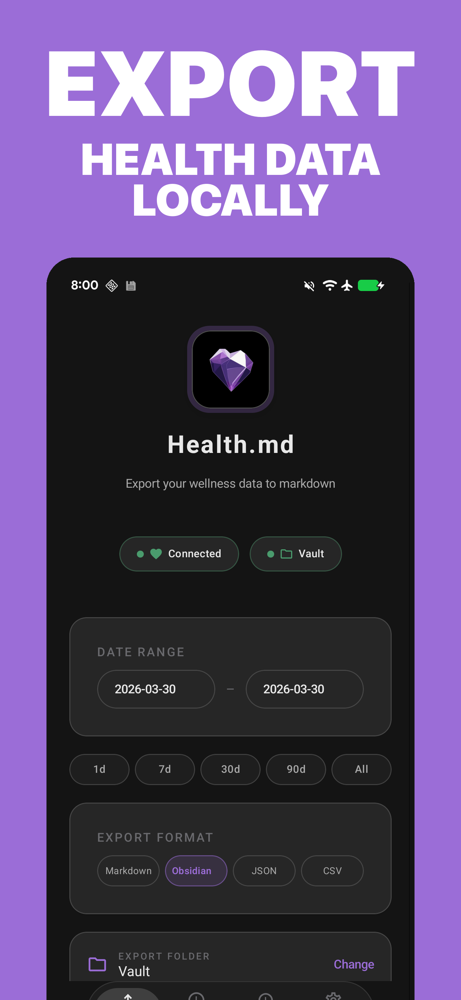
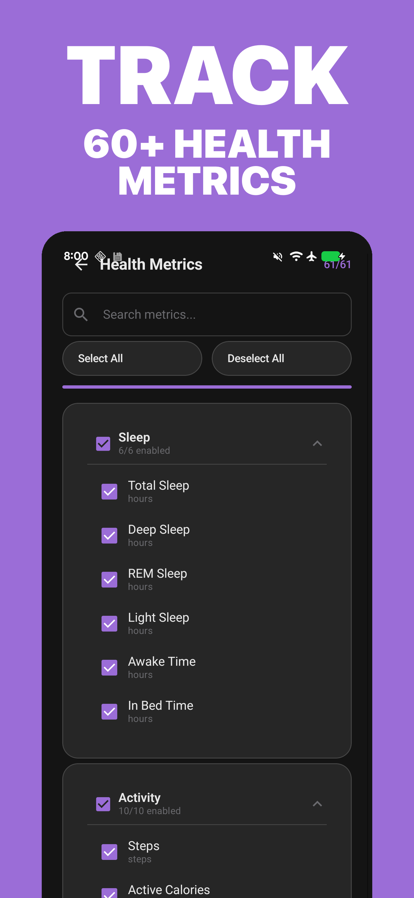
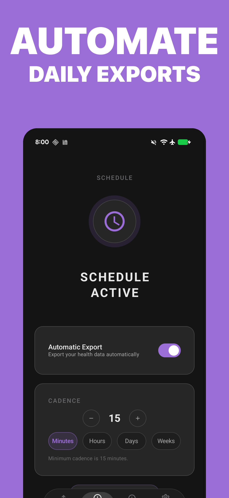

# Health.md for Android

> **Health Connect to Markdown, JSON, CSV, and Obsidian Bases — private files you control.**

[](LICENSE)
[](#tech-stack)
[](#tech-stack)
[](#tech-stack)

Health.md for Android turns Health Connect into a local-first health journal. Pick the metrics you care about, preview the output, then export clean Markdown, JSON, CSV, or Obsidian Bases YAML to a folder on your device, an Obsidian vault, or any Android document provider you choose. No accounts. No health-data cloud. Your health records stay on your phone and in folders you control.

**[🌐 healthmd.isolated.tech](https://healthmd.isolated.tech)** · **[▶️ Google Play](https://play.google.com/store/apps/details?id=com.healthmd.android)** · **[📚 Docs](docs/)** · **[🐛 Issues](https://github.com/CodyBontecou/health-md-android/issues)** · **[💬 Discord](https://discord.gg/jNRWSSSz4N)** · **[⭐ Star this repo](https://github.com/CodyBontecou/health-md-android)**

## Screenshots

<table>
  <tr>
    <td align="center"></td>
    <td align="center"></td>
    <td align="center"></td>
  </tr>
  <tr>
    <td align="center"><strong>Export Health Connect data</strong></td>
    <td align="center"><strong>Choose the metrics you want</strong></td>
    <td align="center"><strong>Automate scheduled exports</strong></td>
  </tr>
</table>

## Features

### Health Connect Export

Read Health Connect data on Android and write it to plain files. Health.md supports 106 selectable Health Connect metrics across sleep, activity, heart, respiratory, vitals, body measurements, nutrition, mobility, mindfulness, reproductive health, planned/completed workouts, and feature-gated medical resources.

### Obsidian-Native Journaling

Export daily notes directly into an Obsidian vault or synced folder, use date placeholders in folder paths, customize Markdown templates, inject health sections into existing daily notes, and emit Obsidian Bases frontmatter so your health data becomes queryable in database views.

### Multiple File Formats

Choose any combination of:

- **Markdown** — readable daily summaries with optional frontmatter
- **Obsidian Bases** — YAML/frontmatter-first notes for database queries
- **JSON** — structured payloads for analysis, automation, and the Health.md Obsidian plugin
- **CSV** — one row per metric or timestamped sample for spreadsheets and notebooks

One export action can write multiple formats for multiple days.

### Metric Selection & Formatting

Search metrics, enable categories, choose units, customize metric names, control filename templates (`{date}`, `{year}`, `{month}`, `{weekday}`), organize exports into folders with placeholders like `{year}/{month}` or `{quarter}`, and optionally include Android compatibility keys for existing scripts.

### Individual Entry Tracking

Alongside daily summaries, Health.md can create timestamped files for individual records:

- **Workouts** with duration, calories, distance, route status, splits, metadata, and granular samples when Health Connect provides them
- **Sleep stages** and other timestamped samples for graph reconstruction
- **Vitals** such as blood pressure, blood glucose, body temperature, and weight readings

Example output:

```text
vault/
├── Health/
│   └── 2026-02-05.md
└── entries/
    ├── workouts/
    │   └── 2026_02_05_0700_workouts.md
    ├── sleep/
    │   └── 2026_02_05_2230_sleep_rem.md
    └── vitals/
        └── 2026_02_05_0900_blood_pressure.md
```

### Automation & Shortcuts

Schedule exports with WorkManager, recover missed scheduled dates, retry from export history, and trigger exports from Tasker, adb, or other automation tools through explicit broadcast intents. Launcher shortcuts open Export, Schedule, and History.

### Android-Native Destinations

Android exports through the Storage Access Framework, so users can choose local folders or provider-backed folders exposed by Google Drive, OneDrive, Syncthing, Obsidian Sync, or another document provider. The app does not need a Health.md server to move health files around.

## Pricing

Health.md includes **3 free manual export actions** so you can verify permissions, folder access, formats, and your Obsidian workflow.

Unlimited exports and scheduled automation are unlocked with a **one-time lifetime purchase** through Google Play Billing. No subscription. No recurring charge. The live price is shown by Google Play inside the app.

The free counter tracks export actions, not files: exporting Markdown + JSON + CSV for a date range still counts as one export action.

## Tech Stack

- **Language:** Kotlin 2.1
- **UI:** Jetpack Compose + Material 3
- **Minimum Android:** 9.0 / API 28
- **Compile SDK:** 36
- **Health data:** AndroidX Health Connect Client 1.2.0-alpha02
- **Purchases:** Google Play Billing 7
- **Automation:** WorkManager, boot recovery, launcher shortcuts, explicit broadcast intents
- **Storage:** Storage Access Framework, DataStore Preferences, Room
- **Dependency injection:** Hilt + KSP
- **Serialization:** kotlinx.serialization JSON

### Frameworks Used

| Framework | Purpose |
|-----------|---------|
| Health Connect | Health permission flow, aggregate reads, records, historical/background access |
| Jetpack Compose / Material 3 | Android interface, onboarding, export, settings, paywall, and schedule screens |
| Navigation Compose | Screen routing and nested settings flows |
| Hilt | Dependency injection for repositories, managers, workers, and view models |
| WorkManager | Scheduled exports, retry/recovery behavior, and reboot rescheduling |
| DataStore Preferences | Export settings, folder URIs, purchase state, and local flags |
| Room | Export history database and retry diagnostics |
| Google Play Billing | One-time lifetime unlock |
| Play In-App Review | User-initiated review prompt after successful exports |
| kotlinx.serialization | JSON export contracts and persisted settings models |
| Timber | Debug logging |

## Project Structure

```text
app/
  src/main/
    java/com/healthmd/
      automation/                    # Explicit Tasker/adb broadcast receiver
      data/
        billing/                      # Google Play Billing implementation
        export/                       # Markdown, JSON, CSV, Bases, daily-note, individual-entry exporters
        health/                       # Health Connect manager, provider catalog, and failure classification
        history/                      # Room export-history persistence
        scheduler/                    # WorkManager scheduled exports and recovery
        settings/                     # DataStore-backed user settings
        storage/                      # Storage Access Framework file writes
      di/                             # Hilt modules
      domain/
        billing/                      # Freemium/export accounting policies
        export/                       # Export orchestration policy
        model/                        # Health data, metrics, export settings, templates, history
        repository/                   # Repository interfaces
      presentation/
        common/                       # Shared Compose controls
        export/                       # Export screen and preview/progress UI
        history/                      # Export history and retry UI
        i18n/                         # Localized metric/category labels
        metrics/                      # Metric selection UI
        navigation/                   # Compose navigation graph
        onboarding/                   # First-run setup flow
        paywall/                      # Lifetime unlock screen
        release/                      # In-app release notes
        schedule/                     # Scheduled export UI
        settings/                     # Advanced settings, format, frontmatter, daily notes
        theme/                        # Design tokens and Material theme
    res/                              # Icons, strings/localizations, shortcuts, themes
  src/test/java/com/healthmd/          # Unit, export-contract, billing, scheduler, and view-model tests

docs/                                 # Export-contract docs, parity notes, automation, accessibility
fastlane/                             # Optional Google Play upload lanes
play-console/                         # Play Console listing assets and screenshots
play-store-screenshots/               # Marketing screenshot generator and rendered screenshots
gradle/                               # Gradle wrapper and version catalog
```

## Build Targets

| Gradle target | Application ID / namespace | Platform |
|---------------|----------------------------|----------|
| `:app:assembleDebug` | `com.healthmd.android` / `com.healthmd` | Android debug APK |
| `:app:bundleRelease` | `com.healthmd.android` / `com.healthmd` | Google Play AAB |
| `:app:testDebugUnitTest` | `com.healthmd` | JVM unit and contract tests |
| `:app:connectedDebugAndroidTest` | `com.healthmd.android` | Instrumented Android tests |

## Setup

1. Install Android Studio with JDK 17 and the Android SDK.
2. Open this repository in Android Studio and let Gradle sync.
3. Use a Health Connect-capable device or emulator.
4. Run the debug app and grant Health Connect permissions.
5. Choose an export folder through Android's folder picker.
6. Optional: choose an Obsidian vault or synced provider folder if your document provider exposes write access through the Storage Access Framework.

### Build from CLI

```bash
# Debug build
./gradlew :app:assembleDebug

# Install debug build on the connected device
./gradlew :app:installDebug

# Release app bundle for Google Play
./gradlew :app:bundleRelease
```

Release signing is loaded from `local.properties` and must never be committed:

```properties
RELEASE_STORE_FILE=health-md-release.jks
RELEASE_STORE_PASSWORD=...
RELEASE_KEY_ALIAS=...
RELEASE_KEY_PASSWORD=...
```

### Google Play Publisher

Gradle Play Publisher and Fastlane are both configured for Play Console uploads. Keep the service-account JSON outside the repo and pass its path through an environment variable or Gradle property:

```bash
PLAY_CONSOLE_KEY_PATH="$HOME/.config/play-console/health-md-android.json" ./gradlew :app:publishBundle
```

See `GRADLE_PLAY_PUBLISHER_SETUP.md`, `PLAY_STORE_SETUP.md`, and `GOOGLE_PLAY_BILLING_SETUP.md` for release setup notes.

## Testing

Run the unit and export-contract suite:

```bash
./gradlew :app:testDebugUnitTest
```

Focused commands:

```bash
./gradlew :app:testDebugUnitTest --tests com.healthmd.export.PluginCompatibilityValidationTest
./gradlew :app:testDebugUnitTest --tests com.healthmd.exportcontract.ReleaseReadinessTest
./gradlew :app:lintDebug
./gradlew :app:connectedDebugAndroidTest
```

The export-contract tests verify Android output compatibility with the iOS Health.md schema and the obsidian-health-md plugin.

## Permissions & Entitlements

Health.md requests permissions only when a feature needs them:

- **Health Connect read access** — required to export selected health categories
- **Health Connect historical access** — used for large manual exports beyond the normal read window
- **Health Connect background access** — used only when scheduled exports are enabled
- **Notifications** — optional status notifications for completed or failed scheduled exports
- **Boot completed** — reschedules exports after device restart
- **User-selected files** — writes to folders chosen through Android's Storage Access Framework
- **Explicit automation receiver** — allows Tasker/adb integrations without implicit broadcast triggers

## Privacy

Health data stays local-first:

- Health Connect records are read on Android and written directly to folders you choose.
- Exports can target local folders or provider-backed folders; Health.md does not run a health-data cloud.
- Optional direct cloud-provider imports use provider OAuth tokens stored on-device; enabling those providers sends requests directly to that provider's API.
- Scheduled exports run locally through WorkManager and use Health Connect background access only when you enable scheduling.
- Export history and settings are stored locally with Room and DataStore.
- Billing is handled by Google Play; health samples and exported files are not sent to a Health.md server.
- Feedback, GitHub issues, Discord links, and review prompts are user-initiated.

If you want the strictest local setup, use manual exports, choose a local-device folder, and leave Scheduled Exports disabled.

## Documentation

- [Android automation intents](docs/android-automation-intents.md) — Tasker/adb broadcast actions and examples
- [Android desktop destination strategy](docs/android-desktop-destination.md) — SAF folder/provider model and desktop-sync guidance
- [Accessibility audit](docs/accessibility-android.md) — TalkBack and large-font notes
- [Android ↔ Obsidian plugin compatibility report](docs/export-contract/compatibility-report.md) — JSON, Markdown/Bases, and CSV validation status
- [Android/iOS export gap matrix](docs/export-contract/android-ios-gap-matrix.md) — parity plan and platform-specific differences
- [Health Connect phase 2 mapping](docs/export-contract/health-connect-phase2-mapping.md) — Health Connect field mapping details
- [Health provider support](docs/health-provider-support.md) — supported Android/wearable ecosystems and direct-import requirements
- [Health provider beta test checklist](docs/provider-beta-test-checklist.md) — tester flow and redacted diagnostics guidance for provider verification
- [Workout details](docs/features/workout-details.md) — workout export fields, route status, splits, and granular samples

## Contributing

Bug reports, feature ideas, docs fixes, and pull requests are welcome. Open an issue with the Android workflow you are trying to build, the export format you need, or the Health Connect category you want Health.md to support next.

## License

Health.md is licensed under the [GNU Affero General Public License v3.0](LICENSE). The AGPL ensures that modified versions — including hosted services — must also publish their source, preserving the local-first privacy promise.
